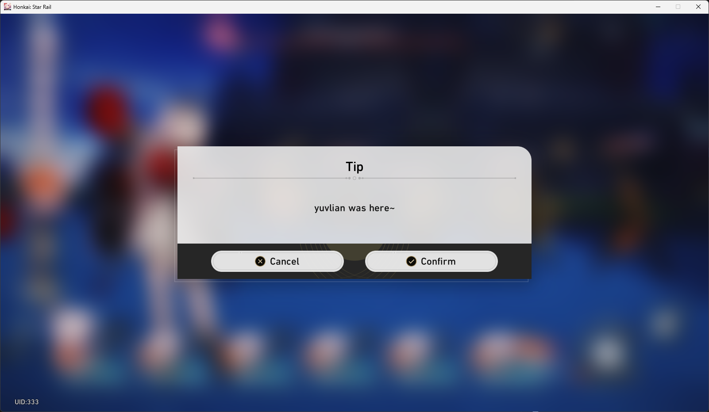
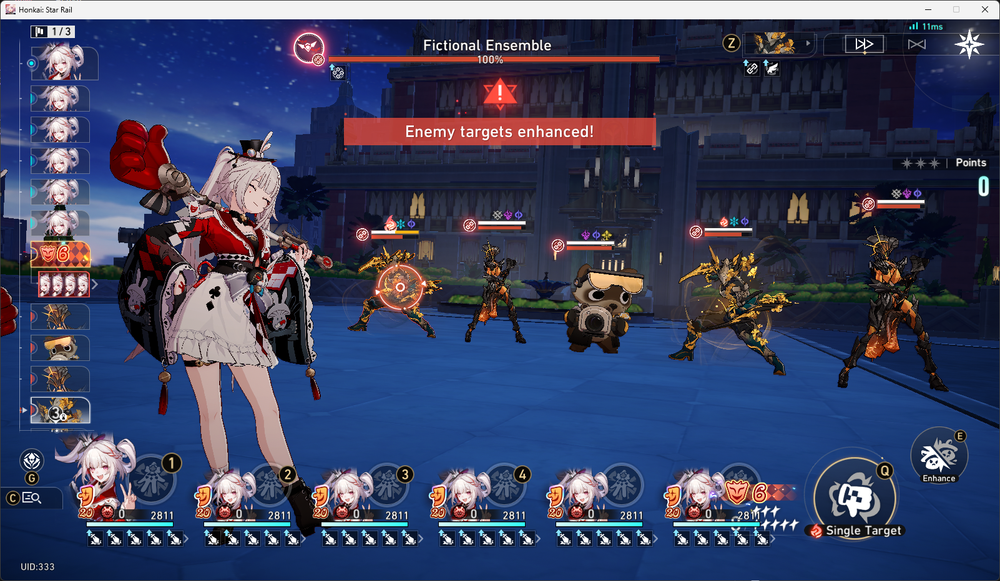

# HongyuanSR

answer me, jia baoyu. what does hsr need?




## features & limitations

- this ps supports the freesr-data.json from https://srtools.neonteam.dev/ for battle
- this ps has limited support for changing stuff ingame:
  - you cant change lightcones, relics, etc. in overworld. you can preview them though.
  - updating freesr-data.json, HOWEVER, will still affect battle. so no need restart if you just care about battle
  - to change mc path and such, edit in db.json and restart gameserver and game
    - ^feel free to make a PR to add commands to fix this inconvenience, can easily be done with change lineup name request instead of bot chat
- this ps has custom battle lineup support (so u can have like 10 sparxie in 1 lineup) through db.json
- this ps can "run" lua. see main.lua and player heartbeat handler if curious.
- lineup change is kinda scuffed, but it won't brick your game.
  - it's just a minor inconvenience where you have to switch to a diff character for the lineup to visually update
  - but even if it didn't visually update, it will still take effect in battle
- some buffs are hardcoded (like global buffs) or hardcoded for 1st character in lineup (like cerydra's and DHPT's technique)
- and many more i guess. idk, idc. im too lazy to add more things. again, feel free to make a PR. or open an issue and pray its enough for me to care lol

oh and, if game updates, you need to update .proto file and CmdId.json, which you can get from https://github.com/yuvlian/proto-archive, don't forget to recompile, ofc.


## tutorial

### step 1: install uv from https://docs.astral.sh/uv/#installation

### step 2: clone this repo
  - git clone https://github.com/yuvlian/hongyuansr
  - cd hongyuansr

#### step 2: get a kcp shim (mine for example)
  - git clone https://github.com/yuvlian/kcpshimmy
  - cd kcpshimmy
  - uv run shim.py

note: you have to compile kcp yourself if you're not on windows

### step 3: download protoc (NOT protobuf) from https://github.com/protocolbuffers/protobuf/releases and then add to PATH env variables.

### step 4: compile protos. run in hongyuan sr terminal.
  - uv run protoc -I . --python_betterproto2_out=./proto StarRail.proto

### step 5: start the server. you can do that by running:
  - uv run -m gameserver
  - uv run -m sdkserver

make sure kcpshimmy is running properly. or any other kcp shim.

### step 6: enable ur proxy or idk use a redirect patch
if ur using fiddler classic:
```c#
import System;
import System.Windows.Forms;
import Fiddler;
import System.Text.RegularExpressions;

class Handlers
{
    static function OnBeforeRequest(oS: Session) {
        if (oS.host.EndsWith(".starrails.com") || oS.host.EndsWith(".hoyoverse.com") || oS.host.EndsWith(".mihoyo.com") || oS.host.EndsWith(".bhsr.com")) {
            oS.oRequest.headers.UriScheme = "http";
            oS.host = "127.0.0.1";
            oS.port = 21000;
        }
    }
};
```

### step 7: open game and have fun

oh right, you can just run start.bat next time to automatically start shim, gameserver, and sdkserver.
