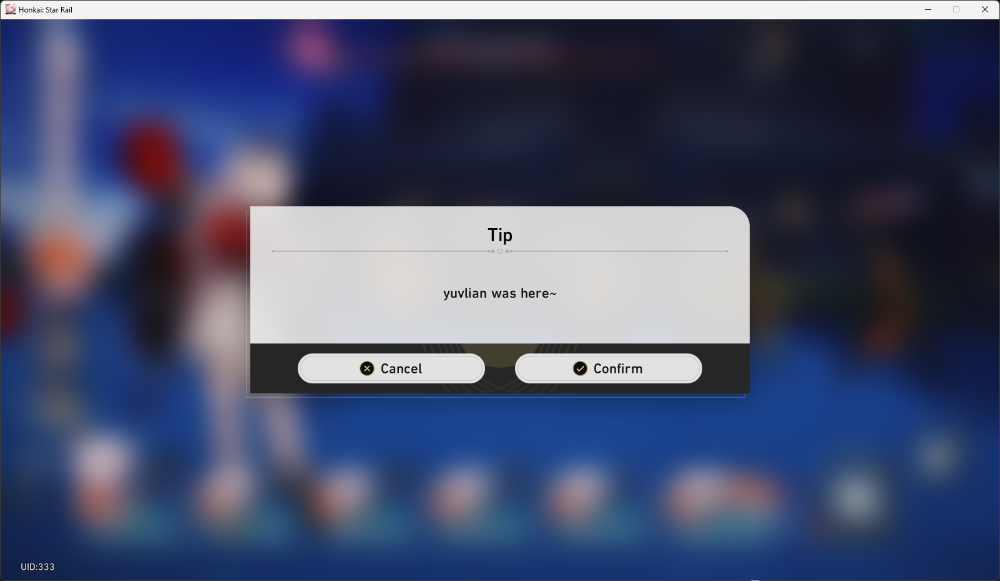
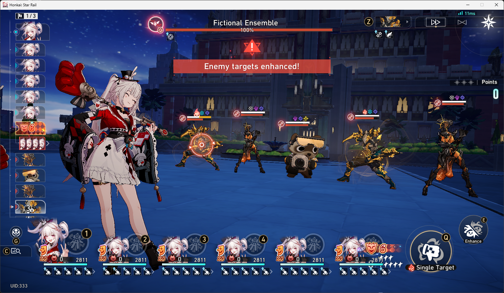

# echium-server

Honkai: Star Rail private server (4.4.55)

Incase I haven't updated this project in a while, you can try updating it yourself with https://github.com/yuvlian/hsr-proto

## General Showcase

<details>
<summary>Screenshots</summary>

-- --

| | |
|---|---|
|  |  |
| | |

</details>

-- --

<details>
<summary>Features</summary>

-- --

- Battle through calyx with `freesr-data.json` (from https://srtools.neonteam.dev/) support, global buffs (toggleable), etc.

- Overworld lineup works and there is custom battle lineup support (like the 10 sparxie screenshot).

- Lua helper.

- Some commands through user signature/bio:

    | Command | Arguments | Description | Example |
    | :--- | :--- | :--- | :--- |
    | `tb` | `<id / path>` | Change Trailblazer path | `tb 8002`, `tb stelle_destruction` |
    | `m7` | `<id / path>` | Change March 7th path | `m7 1224`, `m7 march_hunt` |
    | `gb` | `cast` / `sw` `<on/off>` | Toggle global buffs for Castorice or Silver Wolf | `gb cast on`, `gb sw off` |
    | `cl` | `add <id1> <id2>...` | Add characters to custom battle lineup | `cl add 1001 1001` |
    | `cl` | `clear` | Reset custom battle lineup | `cl clear` |
    | `sync` | - | Sync relics, lightcones, and inventory from `freesr-data.json` | `sync` |

</details>

-- --

<details>
<summary>Known Limitations</summary>

-- --

- You cannot change lightcones, relics, etc. in the game. You can preview them ingame and change them by updating the `freesr-data.json` and then running the `sync` command to update the preview.

- Changing multi path (trailblazer, march) uses commands.

- Some buffs are hardcoded, like Cerydra's and DHPT's technique being hardcoded to the first in lineup.

- Many things aren't implemented like maps, etc.

</details>

## Setup (Windows)

<details>
<summary>Prerequisites</summary>

-- --

- **uv**: https://docs.astral.sh/uv/getting-started/installation/ follow the instructions there
- **protoc**: https://github.com/protocolbuffers/protobuf/releases/download/v35.1/protoc-35.1-win64.zip extract and be sure to put it in PATH environment variable

</details>

-- --

<details>
<summary>Running</summary>

-- --

### Everything below assumes PowerShell

1. `git clone https://github.com/yuvlian/echium-server --recursive`

2. `cd echium-server`

3. `./setup`

4. `./start`

</details>

-- --

<details>
<summary>Playing</summary>

-- --

1. Download https://github.com/yuvlian/echium/releases/download/0.1.0/win-x64.7z

2. Extract & copy `.dll` and `.ini` to same folder as `StarRail.exe`

3. Rename `.dll` file to `umpdc.dll`

4. Edit `.ini` file content as needed (the default should work just fine)

5. Run game

</details>

## Project Meta

<details>
<summary>Structure</summary>

-- --

```
echium-server/
├── StarRail.proto         # hsr protobufs
├── CmdId.json             # cmd ids
├── common/                # shared stuff
│   ├── db.py              # db.json stuff
│   ├── res.py             # resource loader
│   ├── res/               # resource data
│   ├── srtools.py         # freesr-data.json stuff
│   └── util.py            # utils
├── gameserver/            # game server
│   ├── client.py          # client connection
│   ├── connection.py      # packet framing
│   ├── packet.py          # packet encode/decode
│   ├── handler.py         # handler base
│   ├── faker.py           # fake connection thingy
│   └── handlers/          # handlers (avatar, battle, scene, ...)
├── sdkserver/             # sdk/dispatch server
├── kcpshimmy/             # kcp -> tcp shimmer
├── proto/                 # proto lib output
├── main.lua               # lua that the server can send
├── setup.bat              # setup script
├── start.bat              # start servers
└── tidy.bat               # for dev
```

</details>

-- --

<details>
<summary>License</summary>

-- --

Unlicense

</details>

